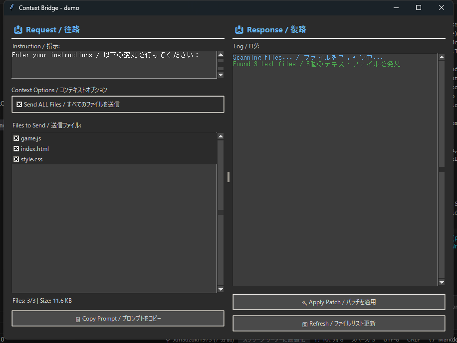

# Context Bridge for Antigravity

**[English README is here](README.md)** | **[英語版 README はこちら](README.md)**

外部Web AI（Google AI Studio, ChatGPT等）をAPIキー不要で活用する「Human Relay（人間中継）」スキルです。

[](https://opensource.org/licenses/MIT)
[](https://www.python.org/downloads/)

## 🎯 特徴

- **API消費ゼロ**: クリップボード経由でのやり取りのため、APIキーやトークン消費なし
- **大規模コンテキスト対応**: Gemini 3.0 Proなら100万トークンまで送信可能
- **安全な操作**: 専用GUIでターミナルへの誤ペースト事故を防止
- **自動パッチ適用**: AIの応答から変更箇所を自動検出して適用
- **標準ライブラリのみ**: 追加インストール不要（Python標準の`tkinter`を使用）
- **ダークテーマ**: 目に優しいモダンなダークUI

## 📸 スクリーンショット



*バイリンガル対応（英語/日本語）のダークテーマUI*
## 📦 インストール

### 前提条件

- Python 3.7以上
- Antigravity（Google Deepmind AI Agent）

### セットアップ手順

#### 方法1: Antigravityに自動インストールさせる（推奨）⚡

Antigravityのチャットで以下のように指示するだけで、自動的にインストールされます：

```
このスキル（Context Bridge）を適切な場所に配置してください。
```

または：

```
ContextBridgeフォルダをスキルディレクトリにインストールして
```

Antigravityが自動的に：
1. このREADMEを読んで理解
2. 適切なディレクトリ構造を作成
3. 必要なファイルをコピー
4. スキルを認識

#### 方法2: 手動でインストール

1. **スキルフォルダをコピー**

   Antigravityのスキルディレクトリにこのフォルダをコピーします：
   
   ```bash
   # Windowsの場合
   xcopy /E /I ContextBridge "%USERPROFILE%\.agent\skills\manual_bridge"
   
   # macOS/Linuxの場合
   cp -r ContextBridge ~/.agent/skills/manual_bridge
   ```

2. **ファイル構成の確認**

   以下のファイルが配置されていることを確認：
   
   ```
   ~/.agent/skills/manual_bridge/
   ├── tools/
   │   └── bridge_gui.py          # メインGUIアプリケーション
   ├── skills/
   │   └── manual_bridge.md       # スキル定義ファイル
   ├── .agent/
   │   └── workflows/
   │       └── open-airlock.md    # Antigravity用ワークフロー
   ├── docs/
   │   ├── en/                    # 英語ドキュメント
   │   │   ├── README.md
   │   │   ├── PLANNING.md
   │   │   └── SPECIFICATION.md
   │   └── ja/                    # 日本語ドキュメント
   │       ├── README.md
   │       ├── PLANNING.md
   │       └── SPECIFICATION.md
   ├── demo/                      # デモプロジェクト（削除可）
   │   ├── index.html
   │   ├── style.css
   │   └── game.js
   └── LICENSE                    # ライセンス情報
   ```

3. **Antigravityで認識させる**

   Antigravityを再起動するか、以下のコマンドを実行：
   
   ```
   スキルをリロード
   ```

## 🚀 使い方

### 1. GUI起動

Antigravityのチャットで以下のコマンドを入力：

```
/open-airlock
```

または自然言語で：
```
Context Bridgeを起動して
```

### 2. 往路（プロジェクト → Web AI）

1. **指示を入力**: GUIの「指示」欄にタスクを入力
   ```
   ボールの速度を2倍にして、ブロックの色をランダムにしてください
   ```

2. **ファイル選択**: デフォルトで全ファイルが選択されています（必要に応じて調整）

3. **コピー**: 「📋 プロンプトをコピー」ボタンをクリック

4. **Web AIにペースト**: 
   - [Google AI Studio](https://aistudio.google.com/) を開く
   - Ctrl+V でペースト、送信

### 3. 復路（Web AI → プロジェクト）

1. **AI応答をコピー**: Ctrl+A → Ctrl+C

2. **適用**: GUIに戻り「🔨 パッチを適用」ボタンをクリック

3. **確認**: ログエリアで適用結果を確認

## 🎨 デモプロジェクト

`demo/`フォルダにシンプルなブロック崩しゲームが含まれています。

**テスト方法**:
```bash
python tools/bridge_gui.py --cwd demo
```

指示例:
- "ボールの速度を2倍にして"
- "パドルを大きくして"
- "ブロックの色をグラデーションにして"

## 📖 推奨Web AI

| AI | 最新モデル | コンテキスト長 | 推奨度 | URL |
|----|------------|---------------|--------|-----|
| **Google AI Studio** | Gemini 3.0 Pro | 100万トークン | ⭐⭐⭐ | https://aistudio.google.com/ |
| **Claude** | Sonnet 4.5 | 200Kトークン | ⭐⭐ | https://claude.ai/ |

> **Note**: Gemini 3.0 Pro は大規模コンテキストと高速性を兼ね備え、プロジェクト全体の送信に最適です。

## 🔧 トラブルシューティング

### パッチが適用されない

**原因**: AIの出力形式が正しくない

**解決策**: 
- AI応答に `<<<< SEARCH ... ==== ... >>>>` ブロックが含まれているか確認
- システムプロンプトが正しく伝わっているか確認（通常は自動挿入されます）

### ファイルが見つからない

**原因**: パス指定が不正

**解決策**:
- パスが `/` 区切りになっているか確認
- プロジェクトルートからの相対パスになっているか確認

### 文字化けが発生

**原因**: エンコーディングの問題

**解決策**:
- ファイルをUTF-8で保存
- コード内に非ASCII文字がある場合、ファイル先頭に `# -*- coding: utf-8 -*-` を追加

### GUIが起動しない

**原因**: tkinterがインストールされていない

**解決策**:
```bash
# Ubuntu/Debian
sudo apt-get install python3-tk

# macOS (Homebrewの場合)
brew install python-tk

# Windows
# 通常は標準でインストール済み。Pythonを再インストール
```

## 🤝 貢献

バグ報告や機能リクエストは以下で受け付けています：
- Issues: プロジェクトのGitHubリポジトリ
- Pull Request: 歓迎します！

## 📄 ライセンス

MIT License - 詳細は [LICENSE](LICENSE) ファイルを参照してください。

## 🔗 関連リンク

- [Antigravity](https://deepmind.google/technologies/gemini/antigravity/)
- [Google AI Studio](https://aistudio.google.com/)
- [技術仕様書](docs/ja/SPECIFICATION.md)
- [企画概要](docs/ja/PLANNING.md)

## 📞 サポート

質問や問題がある場合：
1. まず[トラブルシューティング](#-トラブルシューティング)を確認
2. [技術仕様書](docs/ja/SPECIFICATION.md)で詳細を確認
3. それでも解決しない場合はIssueを作成

---

**開発者**: [JUN SUZUKI](https://junsuzuki-ai-agency.xyz/)  
**バージョン**: 1.0.0  
**最終更新**: 2026-01-17
